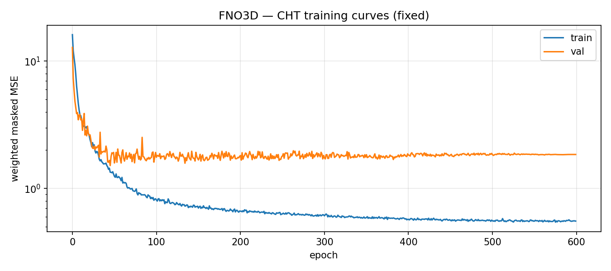
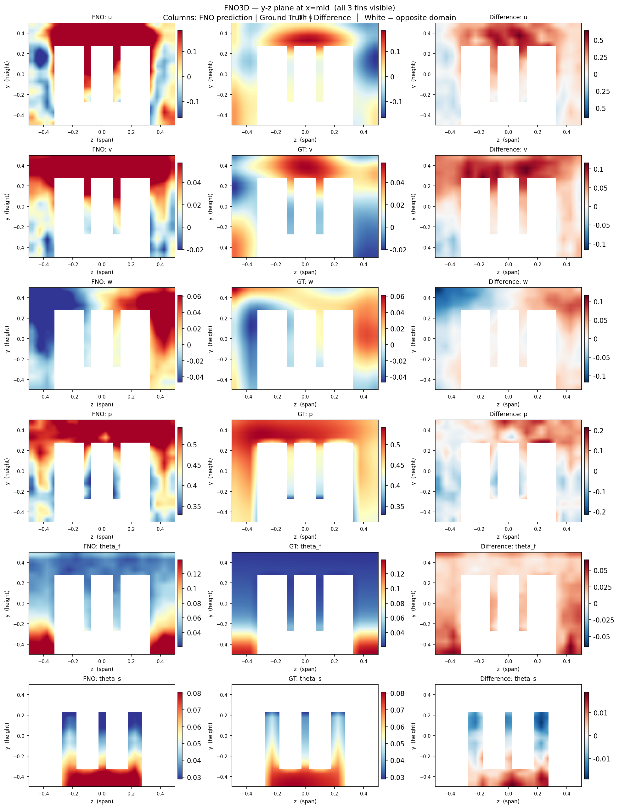
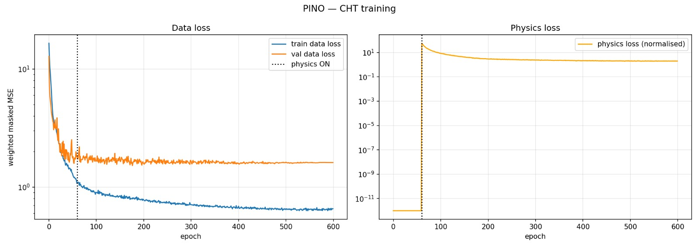
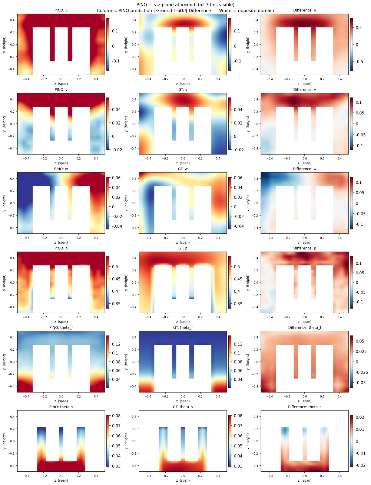
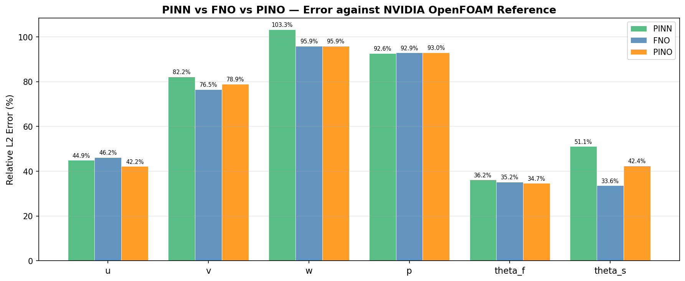
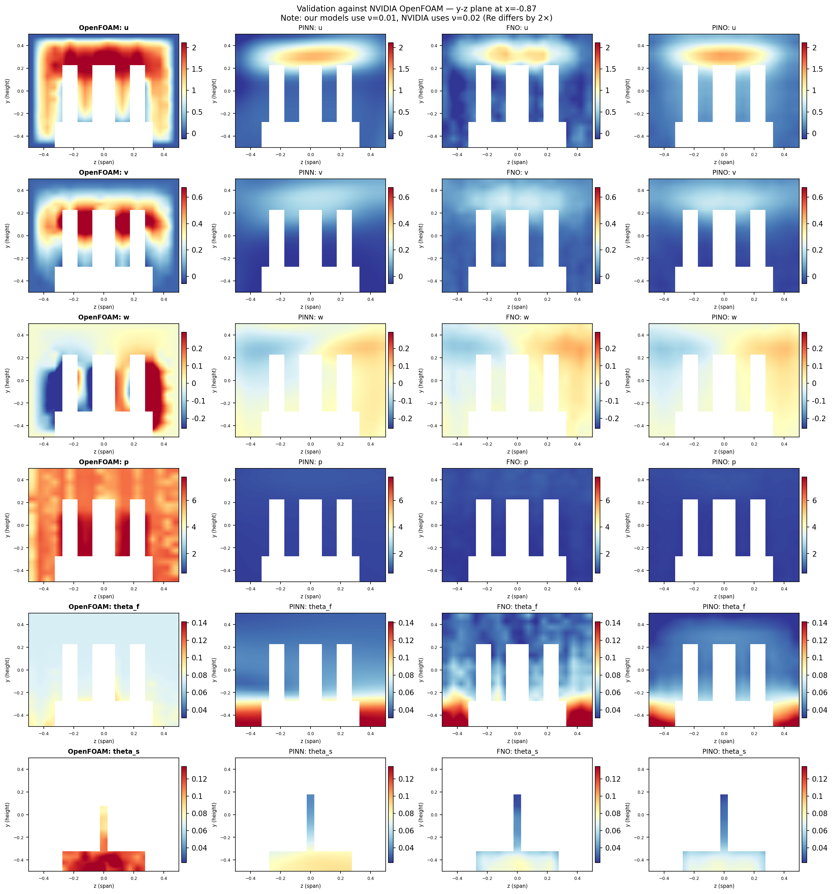
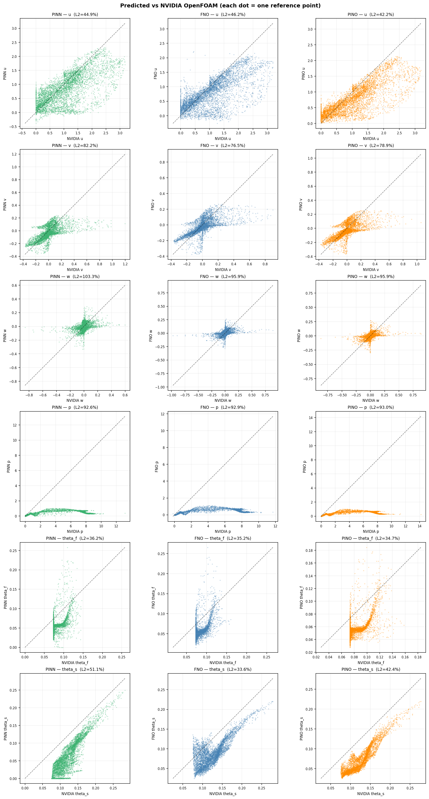

# Physics-Informed Machine Learning: PINNs, FNO & PINO

> A comprehensive study of Physics-Informed Neural Networks (PINNs), Fourier Neural Operators (FNO), and Physics-Informed Neural Operators (PINO) applied to benchmark PDE problems and 3-D conjugate heat transfer.

---

## Table of Contents

- [Overview](#overview)
- [Repository Structure](#repository-structure)
- [Experiments](#experiments)
  - [1. PINNs — 1D & 2D Poisson](#1-pinns--1d--2d-poisson)
  - [2. Fourier Neural Operator (FNO)](#2-fourier-neural-operator-fno)
  - [3. Physics-Informed Neural Operator (PINO)](#3-physics-informed-neural-operator-pino)
  - [4. Inverse Problem: Parameter Identification](#4-inverse-problem-parameter-identification)
  - [5. Interface Problem via VPINN](#5-interface-problem-via-vpinn)
  - [6. 1-D Burger's Flow](#6-1-d-burgers-flow)
  - [7. Navier–Stokes / Kolmogorov Flow](#7-navierstokes--kolmogorov-flow)
  - [8. Conjugate Heat Transfer (3-D)](#8-conjugate-heat-transfer-3-d)
- [Results Summary](#results-summary)
- [Data](#data)
- [Setup & Installation](#setup--installation)
- [Running the Code](#running-the-code)
- [References](#references)

---

## Overview

This project explores how physical laws (expressed as PDEs) can be embedded into neural network training to produce physically consistent solutions with reduced data requirements.

**Three core paradigms are studied:**

| Paradigm | Key Idea |
|---|---|
| **PINN** | MLP trained with a PDE-residual loss via automatic differentiation |
| **FNO** | Operator learned in Fourier space; resolution-invariant, O(N log N) |
| **PINO** | FNO backbone + PDE constraints; merges operator learning with physics |

---

## Repository Structure

```
.
├── 3D_Fno.py                      # 3-D FNO for Conjugate Heat Transfer
├── 3D_Pino.py                     # 3-D PINO for Conjugate Heat Transfer
├── kf.py                          # FNO/PINO for Kolmogorov flow (Navier–Stokes)
├── Pinn_Data_Generation_CHT.py    # PINN-based dataset generator for CHT
├── pinn_inverse.py                # PINN inverse problem (parameter identification)
├── validate_nvidia.py             # Validation against NVIDIA OpenFOAM reference
├── Interface_Problem_VPINNs       # VPINN interface problem experiments
├── Interface_Problem_PINO         # PINO interface problem experiments
├── PINO_1d_Burgers_equation.py    # 1-D Burger's FNO/PINO experiments
├── q5.py                          # Long temporal transient flow
├── results/                       # Output plots (organised by experiment)
│   ├── pinn/
│   ├── vpinn/
│   ├── burgers/
│   ├── kolmogorov/
│   └── cht/
└── data/                          # Datasets (not tracked by git)
```

---

## Experiments

### 1. PINNs — 1D & 2D Poisson

Physics-Informed Neural Networks approximate PDE solutions by minimising a combined loss:

$$\mathcal{L} = \mathcal{L}_{\text{PDE}} + \mathcal{L}_{\text{BC}}$$

**1D Poisson**

| Metric | Value |
|---|---|
| Final loss | $2 \times 10^{-6}$ |
| Agreement | Exact ≈ Predicted |

| Exact Solution | Predicted Solution |
|:---:|:---:|
|  |  |

**2D Poisson**

| Metric | Value |
|---|---|
| $L_2$ error | $3.21 \times 10^{-2}$ |


**Learnable Loss Balancing**

A learnable parameter $k = \exp(\alpha)$ weights the boundary loss: $\mathcal{L} = \mathcal{L}_{\text{PDE}} + k \cdot \mathcal{L}_{\text{BC}}$

| Final $k$ | $L_2$ error |
|---|---|
| 0.685833 | $4.75 \times 10^{-2}$ |


---

### 2. Fourier Neural Operator (FNO)

Each FNO layer applies:

$$v(x) = \sigma\!\left(\mathcal{F}^{-1}\!\left(R(k)\,\mathcal{F}(u)(k)\right) + W\,u(x)\right)$$

Only $|k| \le K$ low-frequency modes are retained, giving $\mathcal{O}(N \log N)$ complexity per layer. The model is **resolution-invariant**: trained at one grid resolution, it generalises to finer or coarser meshes without retraining.

---

### 3. Physics-Informed Neural Operator (PINO)

PINO augments the FNO backbone with a physics loss:

$$\mathcal{L} = \lambda_d\,\mathcal{L}_{\text{data}} + \lambda_p\,\mathcal{L}_{\text{physics}}, \qquad \mathcal{L}_{\text{physics}} = \|\mathcal{N}(v) - f\|^2$$

This reduces label requirements, improves generalisation in sparse-data regimes, and supports both forward and inverse problems.

---

### 4. Inverse Problem: Parameter Identification

**2D Poisson inverse problem** — identify unknown diffusivity coefficients $k_1, k_2$ in:

$$k_1\,u_{xx} + k_2\,u_{yy} = f(x,y)$$

| Method | $k_1$ (true: 1.0) | $k_2$ (true: 1.0) |
|---|---|---|
| **PINN** | 0.9693 | 1.0747 |
| **PINO** | 0.6465 | 0.6176 |

PINN recovers parameters accurately via automatic differentiation. PINO's finite-difference derivative approximation introduces errors that degrade parameter estimation.

| PINN Loss | $k_1$ Error | $k_2$ Error |
|:---:|:---:|:---:|
|  |  |  |

| PINO Loss | PINO $k_1$ | PINO $k_2$ |
|:---:|:---:|:---:|
|  |  |  |

---

### 5. Interface Problem via VPINN

**Problem:** 2D Poisson on $(0,1)^2$ with interface at $x = 0.5$ where $\partial_x u$ is discontinuous.

**Test spaces:**
- Trigonometric: $v_{mn} = \sin(m\pi x)\sin(n\pi y)$
- Bubble-Legendre: $v_{mn} = x(1-x)y(1-y)\,P_m(2x-1)\,P_n(2y-1)$

**VPINN results:**

| Variant | MSE | Relative $L^2$ |
|---|---|---|
| Trig + Legendre | $1.76 \times 10^{-5}$ | 3.76% |
| Quadrature | $1.56 \times 10^{-5}$ | 3.54% |
| Quadrature + RBF | $1.50 \times 10^{-5}$ | **3.47%** |

**PINO results** (64×64 grid, 4 Fourier layers, width 48):

| Metric | Family test set | Tutorial case |
|---|---|---|
| Relative $L^2$ | 3.41% | **2.43%** |
| MSE | $1.24 \times 10^{-5}$ | $7.23 \times 10^{-6}$ |
| Weak residual | $6.02 \times 10^{-6}$ | $3.76 \times 10^{-7}$ |
| Jump loss | $9.93 \times 10^{-3}$ | $9.93 \times 10^{-3}$ |


---

### 6. 1-D Burger's Flow

$$\frac{\partial u}{\partial t} + u\frac{\partial u}{\partial x} = \nu\frac{\partial^2 u}{\partial x^2}, \quad x \in [0,2\pi],\; t \in [0,1]$$

Operator learning: $u(x,0) \mapsto u(x,1)$ on a grid of resolution **8192**.

| | FNO | PINO |
|---|---|---|
| Fourier modes | 2048 | 12 |
| Regularisation | Data only | Data + PDE |
| Training / Test samples | 512 / 1024 | 512 / 1024 |

| FNO — Loss & Prediction | | PINO — Loss & Prediction | |
|:---:|:---:|:---:|:---:|
|  |  |  |  |

---

### 7. Navier–Stokes / Kolmogorov Flow

**Vorticity formulation:**

$$\partial_t \omega + \mathbf{u}\cdot\nabla\omega = \nu\,\Delta\omega + f(x)$$

| Subtask | Details |
|---|---|
| Chaotic Kolmogorov flow | $Re=500$, $t \in [t_0, t_0+1]$, $l=2\pi$, modes $k_{\max}=12$ |
| Transfer learning across $Re$ | Pre-trained at $Re=100$, fine-tuned to $Re=40$ and $Re=500$ |
| Long temporal flow | $T=50$, steps $\{0,5,\dots,50\}$, $64\times64$ grid |

Transfer learning combines a physics loss at the target viscosity with an anchor loss that prevents the model drifting far from its pre-trained weights:

$$\mathcal{L}_{\text{total}} = \beta\,\mathcal{L}_{\text{phys}}(\nu_{\text{target}}) + \alpha\,\mathcal{L}_{\text{anchor}}$$

---

### 8. Conjugate Heat Transfer (3-D)

3-D steady-state conjugate heat transfer over a **parametric finned heat sink** with 6 design parameters (fin height, fin length, fin thickness, temperature gradient, inlet velocity, solid conductivity).

**Pipeline:**

```
Pinn_Data_Generation_CHT.py  →  125-sample PINN dataset
        ↓
3D_Fno.py / 3D_Pino.py  →  3-D operator training  (50 × 20 × 20 grid)
        ↓
validate_nvidia.py  →  Validation vs. NVIDIA OpenFOAM reference
```

#### FNO (`3D_Fno.py`)

Architecture: 4 spectral layers · width 48 · modes $(K_x, K_y, K_z) = (12, 6, 6)$ · Instance Norm + Dropout3d ($p=0.10$)

| Field | Mean Rel-$\ell_2$ (%) | Std (%) |
|---|---|---|
| $u$ | 34.19 | 8.19 |
| $v$ | 45.61 | 13.61 |
| $w$ | 72.27 | 16.63 |
| $p$ | 41.94 | 17.29 |
| $\theta_f$ | 44.09 | 20.91 |
| $\theta_s$ | 57.20 | 27.91 |

| Training Curves | YZ-slice Prediction |
|:---:|:---:|
|  |  |

#### PINO (`3D_Pino.py`)

Same backbone with physics residuals for continuity, fluid energy, and solid Laplace enforced via finite differences. Physics weight $\lambda$ ramps from 0 → 0.05 over epochs 60–180.

| Field | Mean Rel-$\ell_2$ (%) | Std (%) |
|---|---|---|
| $u$ | 36.69 | 9.36 |
| $v$ | 47.34 | 14.78 |
| $w$ | 73.67 | 16.96 |
| $p$ | 42.74 | 18.40 |
| $\theta_f$ | 55.93 | 28.96 |
| $\theta_s$ | **41.49** | 17.33 |

| PDE Residual | Mean MSE |
|---|---|
| Continuity | $2.75 \times 10^{-2}$ |
| Fluid energy | $1.60 \times 10^{-4}$ |
| Solid Laplace | $4.92 \times 10^{0}$ |

| Training Curves | Physics Residuals | YZ-slice Prediction |
|:---:|:---:|:---:|
|  |  |  |

#### Validation vs. NVIDIA OpenFOAM (`validate_nvidia.py`)

> All three models were trained at $\nu=0.01$; the NVIDIA reference uses $\nu=0.02$. The 2× viscosity mismatch is the primary driver of velocity errors — not model failure. Temperature predictions are the more meaningful comparison.

| Field | PINN | FNO | PINO |
|---|---|---|---|
| $u$ | 44.90% / 0.397 | 46.20% / 0.397 | **42.17%** / 0.374 |
| $v$ | 82.24% / 0.078 | 76.54% / 0.069 | 78.92% / 0.072 |
| $w$ | 103.25% / 0.052 | 95.94% / 0.043 | 95.92% / 0.044 |
| $p$ | 92.64% / 2.924 | 92.94% / 2.960 | 92.98% / 2.945 |
| $\theta_f$ | 36.17% / 0.027 | **35.25%** / 0.026 | 34.69% / 0.027 |
| $\theta_s$ | 51.09% / 0.061 | **33.59%** / 0.039 | 42.44% / 0.053 |

*Columns: Rel-L₂ (%) / MAE*

| Per-field Error Bars | YZ-slice Comparison | Predicted vs Reference |
|:---:|:---:|:---:|
|  |  |  |

---

## Results Summary

| Experiment | Best Method | Key Metric |
|---|---|---|
| 1-D Poisson PINN | PINN | Loss 2×10⁻⁶ |
| 2-D Poisson PINN (learnable k) | PINN + learnable k | L₂ = 4.75×10⁻² |
| Inverse problem | PINN | k₁ = 0.97, k₂ = 1.07 |
| Interface problem | PINO | L₂ = 2.43% |
| CHT solid temperature | FNO | Rel-L₂ = 33.6% (vs NVIDIA) |
| CHT fluid temperature | PINO (internal) | Rel-L₂ = 41.5% |

---

## Data

Datasets are hosted on Kaggle — **do not commit them to the repository**.

| Experiment | Dataset | Link |
|---|---|---|
| Conjugate Heat Transfer (training) | `dataset_combined.npz` — 125 PINN-generated samples on a 50×20×20 grid | [subhommahalik/dataset-combined-npz](https://www.kaggle.com/datasets/subhommahalik/dataset-combined-npz) |
| CHT — FNO checkpoint | `best_fno.pt` — best validation checkpoint | [pravega/best-fno-pt](https://www.kaggle.com/datasets/pravega/best-fno-pt) |
| CHT — PINO checkpoint | `best_pino.pt` — best validation checkpoint | [pravega/best-pino-pt](https://www.kaggle.com/datasets/pravega/best-pino-pt) |
| Kolmogorov Flow (Re=500) | `KFvorticity_Re500_N1000_T500.npy` — 1000 trajectories, 500 timesteps, 64×64 | [subhommahalik/kfvorticity-re500-n1000-t500-npy](https://www.kaggle.com/datasets/subhommahalik/kfvorticity-re500-n1000-t500-npy) |
| NVIDIA OpenFOAM CHT reference | `threeFin_extend_fluid0.csv` / `threeFin_extend_solid0.csv` — high-fidelity laminar reference | [pravega/threefin-extend-fluid0-csv](https://www.kaggle.com/datasets/pravega/threefin-extend-fluid0-csv) · [subhommahalik/threefin-extend-solid0](https://www.kaggle.com/datasets/subhommahalik/threefin-extend-solid0) |

> **1-D Burger's equation**, **Poisson (1D/2D)**, and **interface problem** datasets are generated analytically at runtime — no download required.

---

## Setup & Installation

```bash
git clone https://github.com/<your-username>/<repo-name>.git
cd <repo-name>

conda create -n piml python=3.10 -y
conda activate piml

pip install torch torchvision torchaudio --index-url https://download.pytorch.org/whl/cu118
pip install numpy scipy matplotlib scikit-learn tqdm
```

> All experiments were run on a single NVIDIA T4 GPU (Kaggle). A CUDA-enabled GPU is strongly recommended.

---

## Running the Code

| Script | Description | Command |
|---|---|---|
| `Pinn_Data_Generation_CHT.py` | Generate CHT dataset via PINN | `python Pinn_Data_Generation_CHT.py --out results/cht` |
| `3D_Fno.py` | Train 3-D FNO on CHT | `python 3D_Fno.py --out results/cht` |
| `3D_Pino.py` | Train 3-D PINO on CHT | `python 3D_Pino.py --out results/cht` |
| `validate_nvidia.py` | Validate against NVIDIA reference | `python validate_nvidia.py --out results/cht` |
| `kf.py` | Kolmogorov flow FNO/PINO | `python kf.py` |
| `pinn_inverse.py` | PINN inverse problem | `python pinn_inverse.py` |
| `Interface_Problem_VPINNs` | VPINN interface problem | `python Interface_Problem_VPINNs` |
| `Interface_Problem_PINO` | PINO interface problem | `python Interface_Problem_PINO` |
| `PINO_1d_Burgers_equation.py` | 1-D Burger's FNO/PINO | `python PINO_1d_Burgers_equation.py` |
| `q5.py` | Long temporal transient flow | `python q5.py` |

---

## References

1. Li, Z. et al. *Fourier Neural Operator for Parametric Partial Differential Equations.* ICLR 2021.
2. Raissi, M., Perdikaris, P. & Karniadakis, G. E. *Physics-informed neural networks.* Journal of Computational Physics, 2019.
3. Li, Z. et al. *Physics-Informed Neural Operator for Learning Partial Differential Equations.* ACM / JML 2021.
4. NVIDIA PhysicsNeMo Conjugate Heat Transfer Reference Dataset.
5. Cao, S. *Choose a Transformer: Fourier or Galerkin.* NeurIPS 2021.
